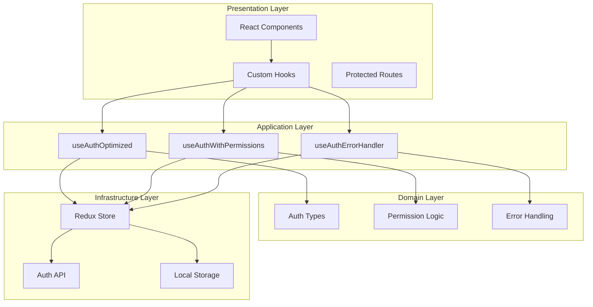
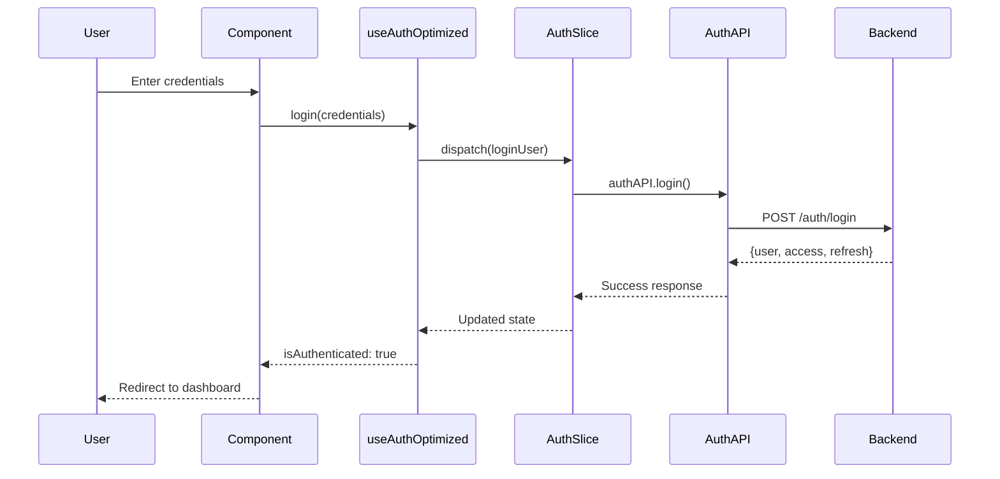
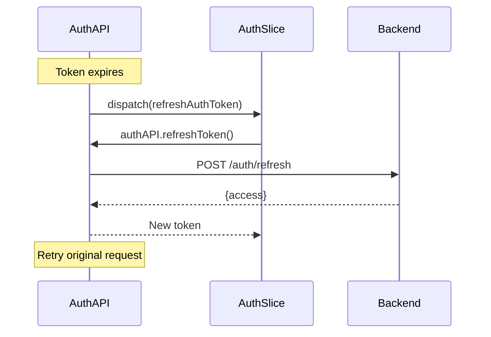
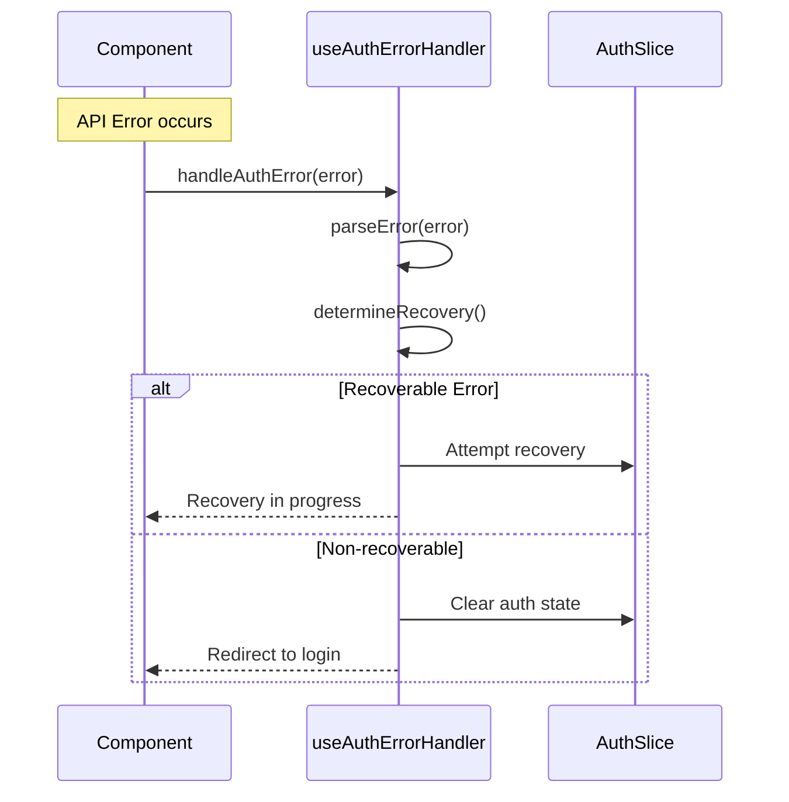

# Arquitectura de Autenticación - Frontend App

## 📋 Índice

1. [Visión General](#visión-general)
2. [Arquitectura del Sistema](#arquitectura-del-sistema)
3. [Componentes Principales](#componentes-principales)
4. [Flujos de Autenticación](#flujos-de-autenticación)
5. [Hooks Personalizados](#hooks-personalizados)
6. [Manejo de Errores](#manejo-de-errores)
7. [Seguridad](#seguridad)
8. [Guías de Uso](#guías-de-uso)
9. [Testing](#testing)
10. [Mejores Prácticas](#mejores-prácticas)

## 🎯 Visión General

El sistema de autenticación está diseñado siguiendo principios de **Clean Architecture** y **Domain-Driven Design**, proporcionando una solución robusta, escalable y mantenible para la gestión de autenticación y autorización en aplicaciones React modernas.

### Características Principales

- **🔐 Autenticación JWT** con refresh tokens
- **🛡️ Autorización basada en roles y permisos**
- **⚡ Performance optimizada** con memoización y selectores
- **🔄 Manejo robusto de errores** con recuperación automática
- **🧪 Testing completo** con tests unitarios e integración
- **📱 Responsive** y accesible (a11y)
- **🎨 TypeScript estricto** para type safety

## 🏗️ Arquitectura del Sistema



### Principios de Diseño

1. **Separation of Concerns**: Cada capa tiene responsabilidades específicas
2. **Single Responsibility**: Cada hook y componente tiene una función clara
3. **Dependency Inversion**: Las capas superiores no dependen de implementaciones concretas
4. **Open/Closed**: Extensible sin modificar código existente

## 🧩 Componentes Principales

### 1. AuthSlice (Redux Toolkit)

**Ubicación**: `src/features/auth/authSlice.ts`

```typescript
interface AuthState {
  user: User | null
  token: string | null
  refreshToken: string | null
  isAuthenticated: boolean
  isLoading: boolean
  error: string | null
}
```

**Responsabilidades**:
- Gestión del estado global de autenticación
- Async thunks para operaciones de API
- Reducers para actualizaciones síncronas

**Acciones Principales**:
- `loginUser`: Autenticación de usuario
- `logoutUser`: Cierre de sesión
- `refreshAuthToken`: Renovación de tokens
- `setUser`: Establecer usuario
- `setAuthenticated`: Actualizar estado de autenticación

### 2. AuthAPI

**Ubicación**: `src/features/auth/authAPI.ts`

**Responsabilidades**:
- Comunicación con el backend
- Manejo de tokens JWT
- Interceptors para requests/responses

### 3. Custom Hooks

#### useAuthOptimized
- **Propósito**: Hook principal optimizado para performance
- **Características**: Memoización, selectores optimizados
- **Uso**: Componentes que necesitan estado básico de auth

#### useAuthWithPermissions
- **Propósito**: Hook con lógica de permisos y roles
- **Características**: Utilidades de autorización, access levels
- **Uso**: Componentes que requieren verificación de permisos

#### useAuthErrorHandler
- **Propósito**: Manejo centralizado de errores de auth
- **Características**: Recuperación automática, retry logic
- **Uso**: Manejo de errores en toda la aplicación

## 🔄 Flujos de Autenticación

### 1. Flujo de Login



### 2. Flujo de Refresh Token



### 3. Flujo de Error Handling



## 🎣 Hooks Personalizados

### useAuthOptimized

```typescript
const {
  // Estado básico
  user,
  token,
  isAuthenticated,
  isLoading,
  error,
  
  // Valores computados (memoizados)
  userDisplayName,
  userRole,
  hasValidToken,
  
  // Acciones de autenticación
  login,
  logout,
  refreshAuth,
  checkStatus,
  
  // Gestión de tokens
  setAuthToken,
  setAuthRefreshToken,
  clearAuthData,
  
  // Gestión de estado
  updateUserData,
  clearAuthError,
  setLoadingState
} = useAuthOptimized()
```

**Características**:
- **Memoización**: Selectores optimizados para evitar re-renders
- **Type Safety**: TypeScript estricto
- **Performance**: Uso eficiente de useCallback y useMemo

### useAuthWithPermissions

```typescript
const {
  // Todo lo de useAuthOptimized +
  
  // Verificación de permisos
  hasPermission,
  hasRole,
  canAccess,
  
  // Utilidades avanzadas
  checkMultiplePermissions,
  getAccessLevel,
  getUserSummary,
  quickPermissions
} = useAuthWithPermissions()
```

**Funciones de Permisos**:

```typescript
// Verificar permiso específico
const canEdit = hasPermission('users.edit')

// Verificar rol
const isAdmin = hasRole('Administradores')

// Verificar acceso a recurso
const canAccessUsers = canAccess('users', 'read')

// Verificar múltiples permisos
const permissions = checkMultiplePermissions([
  'users.read',
  'users.edit'
])

// Obtener nivel de acceso
const accessLevel = getAccessLevel('users')
// { canRead: true, canCreate: false, canUpdate: true, canDelete: false }
```

### useAuthErrorHandler

```typescript
const {
  // Manejo de errores
  handleAuthError,
  clearError,
  resetRetryCounters,
  
  // Estado de errores
  lastError,
  isRecovering,
  
  // Utilidades
  isRecoverable,
  parseError,
  getErrorStats,
  
  // Configuración
  config
} = useAuthErrorHandler(options)
```

**Tipos de Errores Manejados**:
- `UNAUTHORIZED` (401): Token inválido/expirado
- `FORBIDDEN` (403): Permisos insuficientes
- `RATE_LIMITED` (429): Demasiadas peticiones
- `NETWORK_ERROR`: Problemas de conectividad
- `SERVER_ERROR` (5xx): Errores del servidor

## 🛡️ Seguridad

### 1. Gestión de Tokens

```typescript
// Almacenamiento seguro
const tokenStorage = {
  set: (token: string) => {
    // Usar httpOnly cookies en producción
    localStorage.setItem('auth_token', token)
  },
  get: () => localStorage.getItem('auth_token'),
  remove: () => localStorage.removeItem('auth_token')
}
```

### 2. Interceptors de Axios

```typescript
// Request interceptor
api.interceptors.request.use((config) => {
  const token = getAuthToken()
  if (token) {
    config.headers.Authorization = `Bearer ${token}`
  }
  return config
})

// Response interceptor
api.interceptors.response.use(
  (response) => response,
  async (error) => {
    if (error.response?.status === 401) {
      await handleTokenRefresh()
    }
    return Promise.reject(error)
  }
)
```

### 3. Rutas Protegidas

```typescript
const ProtectedRoute: React.FC<ProtectedRouteProps> = ({
  children,
  requiredPermissions = [],
  requiredRoles = [],
  fallback = <Navigate to="/login" />
}) => {
  const { isAuthenticated, hasPermission, hasRole } = useAuthWithPermissions()
  
  if (!isAuthenticated) {
    return fallback
  }
  
  const hasRequiredPermissions = requiredPermissions.every(hasPermission)
  const hasRequiredRoles = requiredRoles.every(hasRole)
  
  if (!hasRequiredPermissions || !hasRequiredRoles) {
    return <Navigate to="/unauthorized" />
  }
  
  return <>{children}</>
}
```

## 📖 Guías de Uso

### 1. Configuración Inicial

```typescript
// store.ts
import { configureStore } from '@reduxjs/toolkit'
import authReducer from './features/auth/authSlice'

export const store = configureStore({
  reducer: {
    auth: authReducer,
  },
})

// App.tsx
import { Provider } from 'react-redux'
import { store } from './store'

function App() {
  return (
    <Provider store={store}>
      <Router>
        <Routes>
          {/* Your routes */}
        </Routes>
      </Router>
    </Provider>
  )
}
```

### 2. Uso en Componentes

```typescript
// LoginForm.tsx
import { useAuthOptimized } from '@/hooks/useAuthOptimized'

const LoginForm: React.FC = () => {
  const { login, isLoading, error } = useAuthOptimized()
  
  const handleSubmit = async (credentials: LoginCredentials) => {
    try {
      await login(credentials)
      // Redirect handled by auth state change
    } catch (error) {
      // Error handled by useAuthErrorHandler
    }
  }
  
  return (
    <form onSubmit={handleSubmit}>
      {/* Form fields */}
      {error && <ErrorMessage error={error} />}
      <button disabled={isLoading}>
        {isLoading ? 'Logging in...' : 'Login'}
      </button>
    </form>
  )
}
```

### 3. Verificación de Permisos

```typescript
// UserManagement.tsx
import { useAuthWithPermissions } from '@/hooks/useAuthWithPermissions'

const UserManagement: React.FC = () => {
  const { canAccess, hasRole } = useAuthWithPermissions()
  
  const canCreateUsers = canAccess('users', 'create')
  const canDeleteUsers = canAccess('users', 'delete')
  const isAdmin = hasRole('Administradores')
  
  return (
    <div>
      <h1>User Management</h1>
      
      {canCreateUsers && (
        <button>Create User</button>
      )}
      
      <UserList 
        showDeleteButton={canDeleteUsers}
        showAdminActions={isAdmin}
      />
    </div>
  )
}
```

### 4. Manejo de Errores

```typescript
// ApiService.ts
import { useAuthErrorHandler } from '@/hooks/useAuthErrorHandler'

const ApiService: React.FC = () => {
  const { handleAuthError } = useAuthErrorHandler({
    maxRetries: 3,
    retryDelay: 1000,
    enableAutoRecovery: true
  })
  
  const fetchData = async () => {
    try {
      const response = await api.get('/data')
      return response.data
    } catch (error) {
      await handleAuthError(error)
      throw error
    }
  }
  
  return null // Service component
}
```

## 🧪 Testing

### 1. Tests Unitarios

```typescript
// useAuthOptimized.test.ts
import { renderHook } from '@testing-library/react'
import { useAuthOptimized } from '../useAuthOptimized'

describe('useAuthOptimized', () => {
  it('should return authenticated state', () => {
    const { result } = renderHook(() => useAuthOptimized(), {
      wrapper: createAuthWrapper({ isAuthenticated: true })
    })
    
    expect(result.current.isAuthenticated).toBe(true)
  })
})
```

### 2. Tests de Integración

```typescript
// auth-integration.test.ts
describe('Auth Integration Tests', () => {
  it('should handle complete login flow', async () => {
    const store = createTestStore()
    
    const { result } = renderHook(() => useAuthOptimized(), {
      wrapper: createWrapper(store)
    })
    
    await act(async () => {
      store.dispatch(setToken('mock-token'))
      store.dispatch(setUser(mockUser))
      store.dispatch(setAuthenticated(true))
    })
    
    expect(result.current.isAuthenticated).toBe(true)
    expect(result.current.user).toEqual(mockUser)
  })
})
```

### 3. Tests E2E

```typescript
// auth.e2e.test.ts
describe('Authentication E2E', () => {
  it('should complete login flow', () => {
    cy.visit('/login')
    cy.get('[data-testid=username]').type('testuser')
    cy.get('[data-testid=password]').type('password')
    cy.get('[data-testid=login-button]').click()
    
    cy.url().should('include', '/dashboard')
    cy.get('[data-testid=user-menu]').should('be.visible')
  })
})
```

## ✅ Mejores Prácticas

### 1. Performance

```typescript
// ✅ Usar selectores memoizados
const userDisplayName = useMemo(() => 
  user ? `${user.first_name} ${user.last_name}` : '', 
  [user]
)

// ✅ Memoizar callbacks
const handleLogin = useCallback(async (credentials: LoginCredentials) => {
  await dispatch(loginUser(credentials))
}, [dispatch])

// ❌ Evitar re-renders innecesarios
// No hacer esto:
const { user } = useSelector(state => state.auth) // Re-render en cada cambio
```

### 2. Type Safety

```typescript
// ✅ Usar tipos estrictos
interface LoginFormProps {
  onSuccess?: (user: User) => void
  redirectTo?: string
}

// ✅ Validar props con Zod
const LoginCredentialsSchema = z.object({
  username: z.string().min(1),
  password: z.string().min(8)
})

type LoginCredentials = z.infer<typeof LoginCredentialsSchema>
```

### 3. Error Handling

```typescript
// ✅ Manejo centralizado de errores
const { handleAuthError } = useAuthErrorHandler()

try {
  await apiCall()
} catch (error) {
  await handleAuthError(error) // Manejo automático
}

// ✅ Fallbacks apropiados
const UserProfile = () => {
  const { user, isLoading, error } = useAuthOptimized()
  
  if (isLoading) return <ProfileSkeleton />
  if (error) return <ErrorBoundary error={error} />
  if (!user) return <Navigate to="/login" />
  
  return <ProfileContent user={user} />
}
```

### 4. Seguridad

```typescript
// ✅ Validar permisos en el frontend Y backend
const DeleteButton = ({ userId }: { userId: number }) => {
  const { canAccess } = useAuthWithPermissions()
  
  if (!canAccess('users', 'delete')) {
    return null // No mostrar si no tiene permisos
  }
  
  const handleDelete = async () => {
    // El backend también debe validar permisos
    await deleteUser(userId)
  }
  
  return <button onClick={handleDelete}>Delete</button>
}

// ✅ Limpiar estado sensible
const logout = useCallback(async () => {
  await dispatch(logoutUser())
  // Limpiar localStorage, cookies, etc.
  clearSensitiveData()
}, [dispatch])
```

### 5. Accesibilidad

```typescript
// ✅ ARIA labels y roles apropiados
const LoginForm = () => (
  <form role="form" aria-labelledby="login-title">
    <h1 id="login-title">Login</h1>
    
    <input
      type="text"
      aria-label="Username"
      aria-required="true"
      aria-describedby="username-error"
    />
    
    <div id="username-error" role="alert">
      {usernameError}
    </div>
  </form>
)
```

## 🔧 Configuración Avanzada

### 1. Configuración de Desarrollo

```typescript
// config/auth.dev.ts
export const authConfig = {
  apiBaseUrl: 'http://localhost:8000/api',
  tokenRefreshThreshold: 5 * 60 * 1000, // 5 minutos
  maxRetries: 3,
  retryDelay: 1000,
  enableDevTools: true,
  logLevel: 'debug'
}
```

### 2. Configuración de Producción

```typescript
// config/auth.prod.ts
export const authConfig = {
  apiBaseUrl: process.env.REACT_APP_API_URL,
  tokenRefreshThreshold: 10 * 60 * 1000, // 10 minutos
  maxRetries: 5,
  retryDelay: 2000,
  enableDevTools: false,
  logLevel: 'error'
}
```

---

## 📚 Referencias

- [Redux Toolkit Documentation](https://redux-toolkit.js.org/)
- [React Query Documentation](https://tanstack.com/query/latest)
- [JWT Best Practices](https://auth0.com/blog/a-look-at-the-latest-draft-for-jwt-bcp/)
- [React Testing Library](https://testing-library.com/docs/react-testing-library/intro/)
- [TypeScript Handbook](https://www.typescriptlang.org/docs/)

---

**Última actualización**: Enero 2024  
**Versión**: 1.0.0  
**Mantenido por**: Equipo de Frontend